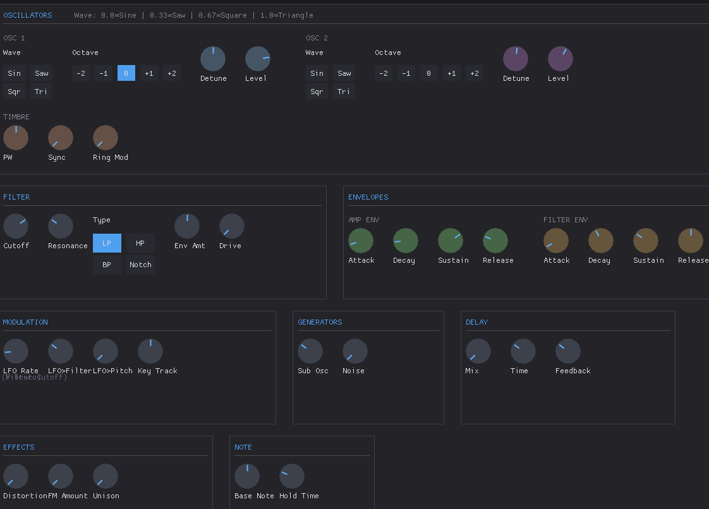
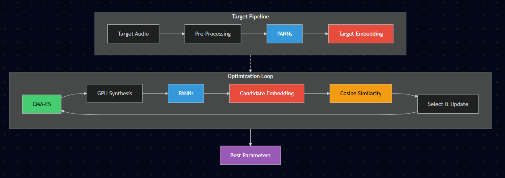

# Audio Synthesis Parameter Matching

GPU-accelerated audio synthesis with CMA-ES parameter optimization. This system uses deep learning embeddings (PANNs) to match synthesizer parameters to target audio through black-box optimization.

## Synthesizer



## How It Works



### Target Processing (once per target audio)

1. **Get Target Audio** - Load any sampled sound
2. **Pre-process** - Detect pitch using pYIN algorithm and estimate noise characteristics
3. **Extract Embedding** - Run through PANNs CNN-14 to get a 2048-dimensional embedding vector

### Optimization Loop (Iterative)

4. **Generate Candidates** - CMA-ES algorithm generates N parameter sets
5. **Synthesize Audio** - GPU renders audio for all candidates in parallel
6. **Extract Embeddings** - Run all candidates through PANNs CNN-14 to get their embedding vectors
7. **Compare** - Calculate cosine similarity between target embedding and each candidate embedding
8. **Select & Update** - CMA-ES selects best candidates and updates the search distribution
9. **Repeat** - Continue until similarity threshold reached or max iterations

The result is a set of synnhesizer parameters that will produce audio perceptually similar to the target.

## System Requirements

- Python >= 3.9
- NVIDIA GPU with CUDA 12.4 support (can run on CPU but is very slow)

## Installation

This project uses UV for dependency management. If you don't have UV installed:

```bash
pip install uv
```

Then install all dependencies:

```bash
uv sync
```

This will install all required packages including PyTorch with CUDA 12.4 support.

## Running the GUI

The interactive GUI allows you to match synthesizer parameters to target audio:

```bash
uv run python run_gui.py
```

Features:

- Load target audio files
- Configure optimization parameters
- Real-time audio playback
- Save matched presets

## Running Validation Sweeps

### PANNs Sensitivity Validation

Test how sensitive PANNs embeddings are to each synthesizer parameter:

```bash
uv run python validation_sweeps/run_sweep_panns.py
```

Options:

- `--quick`: Run a quick validation (fewer sweep points)
- `--param PARAM_NAME`: Test only a specific parameter

### Phase Cancellation Validation

Verify that all parameters actually affect the waveform:

```bash
uv run python validation_sweeps/run_sweep_phase.py
```

Options:

- `--quick`: Run a quick validation (fewer sweep points)
- `--param PARAM_NAME`: Test only a specific parameter

## Project Structure

- `run_gui.py` - Main GUI application
- `match_audio.py` - Command-line audio matching tool
- `core/` - Core synthesis and optimization modules
  - `synthesizer.py` - GPU-accelerated synthesizer
  - `optimizer.py` - CMA-ES optimization
  - `similarity_panns.py` - PANNs-based similarity metric
  - Other similarity metrics (MFCC, spectral, temporal, etc.)
- `gui/` - GUI implementation
- `config/` - Configuration settings
- `validation_sweeps/` - Parameter validation scripts
- `presets/` - Saved synthesizer presets

## Usage Notes

- GPU acceleration is strongly recommended. Without a GPU, optimization will be significantly slower.
- Typical optimization runs take 10-15 minutes for monophonic targets with default settings.
- The system works best with clean, monophonic audio targets.
- Results are saved to the `presets/` directory in JSON format.

## Synthesizer Parameters

The synthesizer has 37 parameters across several categories:

- Oscillators (waveforms, levels, detune, FM, sync, ring mod)
- Filter (type, cutoff, resonance, envelope)
- Envelopes (amp and filter ADSR)
- Effects (noise, LFO, distortion, delay, unison)

All parameters are validated and functional as confirmed by the validation sweeps.
